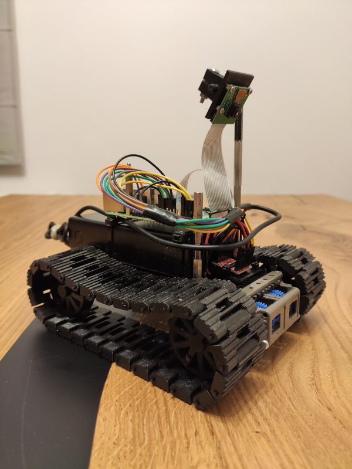

Pt2 is software for simple robots (toys) for Raspberry Pi 3/4. This code is for testing and fun.

Description

Pt2 have two main service:
- mosquitto broker for communication with process and external services
- pitank it's main process which starts every module

Main modules:
- "auto" is for autonomous actions, default empty
- "view" is for access to camera 
- "move" is used for control engines
- "remote" is for bluetooth remote control 
- "sensors" in this module we can add different sensors, default is network sensor for monitoring ip address  

Pt2 software is used in my prototype robot "prot1".

- prot1 is moving between lines.

